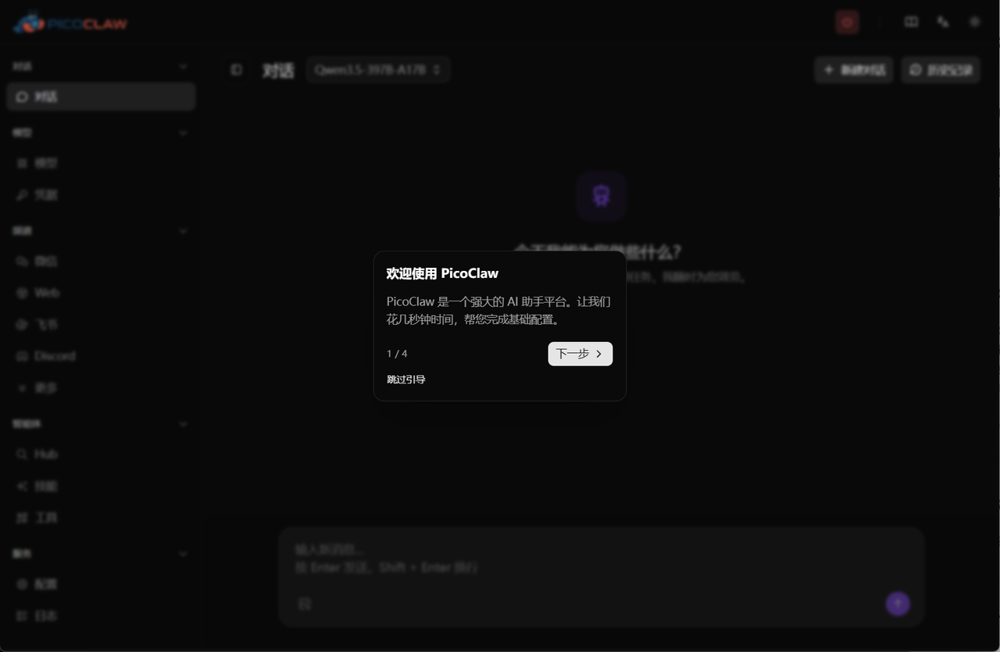
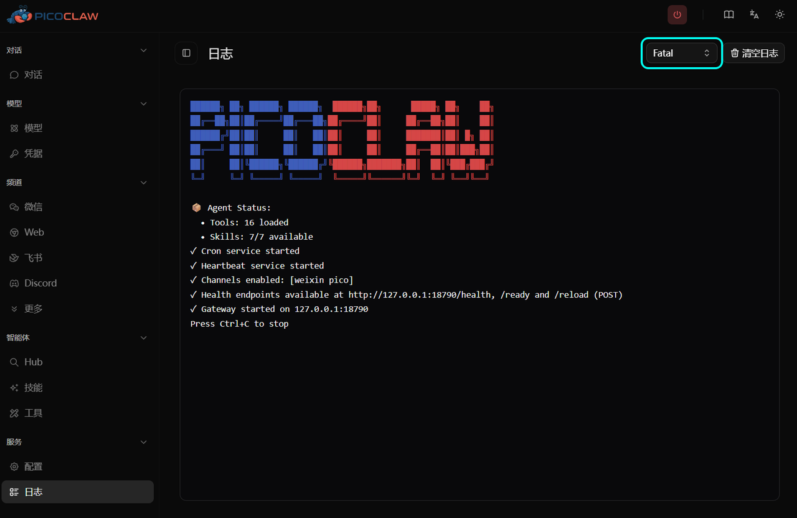
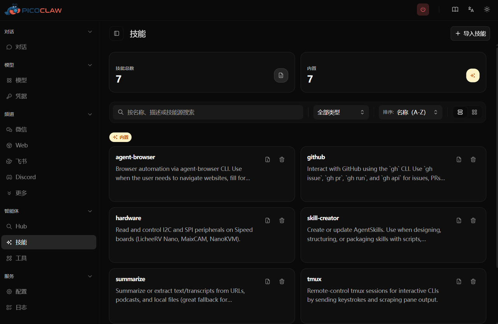
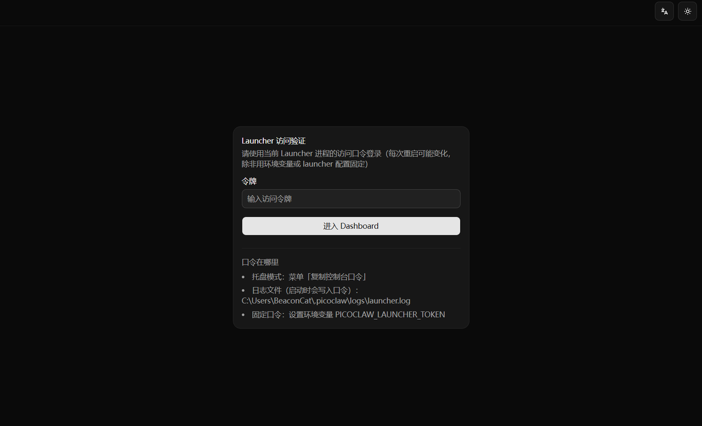
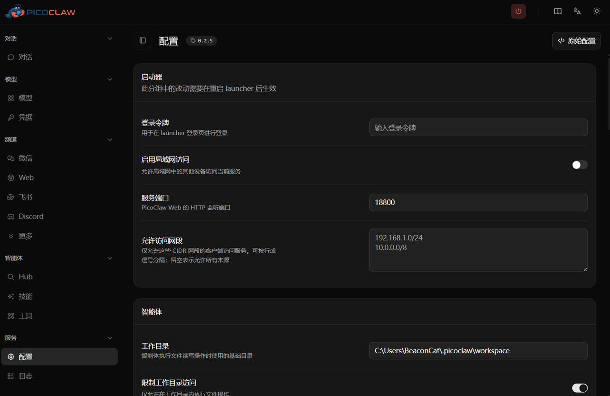

**April 3, 2026**  The PicoClaw team is releasing v0.2.5

There's a lot in this update — here are the highlights

---

## 1. More AI Brains to Choose From

Your AI assistant can now connect to even more models:

- **Venice AI**: A new AI option added to the lineup
- **LM Studio**: Run your favorite models locally — connection is now smoother
- **MIMO**: Another new model provider
- **Azure OpenAI**: Better support for enterprise users on Microsoft's cloud

More choices mean you can pick the AI that works best for you

---

## 2. More Platforms to Chat On

Your AI assistant can now reach you in more places:

- **VK**: Finally available for Russian users — AI comes to VK channels
- **Feishu (Lark)**: Minor fixes, emoji reactions are more stable
- **DingTalk**: Group @ mentions are more accurate — no missed or duplicate replies
- **Telegram**: Quoted replies now include context and media
- **WeChat**: Several bug fixes, conversation context now persists across restarts

One line: AI can chat with you in more places, and the experience is smoother

---

## 3. Toolkit Upgrades

The tools your AI uses to get things done are more powerful:

- **Web search**: You can now specify a time range, e.g. "only results from the past week"
- **File reading**: Supports reading by line range, more flexible for large files
- **Load image**: New `load_image` tool lets AI process local images
- **Background exec**: `exec` tool now supports background execution and PTY — long tasks won't block
- **Reaction tool**: AI can now react to messages with emoji

---

## 4. Web UI Refresh

Open the web UI and you'll notice:

- 🎉 **First-time tour**: A guided walkthrough for new users — no more guessing

- 🖼️ **Image messages**: The web chat now displays image messages

- 🔧 **Log level controls**: Adjust log verbosity right from the web UI — easier debugging

- 🛒 **Skill Marketplace**: Browse and install extension skills with one click

- 🔐 **Dashboard login protection**: Launcher dashboard is now protected with a token

- 🏷️ **Version display**: Backend version shown in the config page header — easy to confirm

---

## 5. Under the Hood

You won't see these directly, but they matter:

- 🚦 **LLM rate limiting**: Requests queue up automatically instead of crashing
- 🧠 **Context manager**: New ContextManager abstraction for smarter long-conversation handling
- 📊 **Token estimation fix**: Fixed double-counting of tokens — no more false overflow warnings
- 🔄 **Auto-updater rewrite**: Version selection and extraction are now more reliable
- 📝 **Log file support**: `PICOCLAW_LOG_FILE` env var lets you write logs to file only

---

## 6. Bug Fixes

- ✅ GitHub Copilot session creation failed — fixed
- ✅ WeChat context lost after restart — fixed (now persisted to disk)
- ✅ Gateway reload caused Pico to stop working — fixed
- ✅ Startup crash (FlexibleStringSlice issue) — fixed
- ✅ Log panel scroll behavior — fixed
- ✅ Skills page dark mode colors — fixed
- ✅ Discord token changes not saving — fixed
- And dozens more small fixes

---

## In One Line

v0.2.5 makes PicoClaw **more capable** (new AI models + new tools), **easier to use** (refreshed UI + first-time tour), and **more stable** (dozens of bug fixes) — a solid upgrade

---

*PicoClaw — Lightweight, cross-platform, fast*

Website: picoclaw.io

GitHub: github.com/sipeed/picoclaw

Docs: docs.picoclaw.io

Discord: discord.gg/V4sAZ9XWpN
