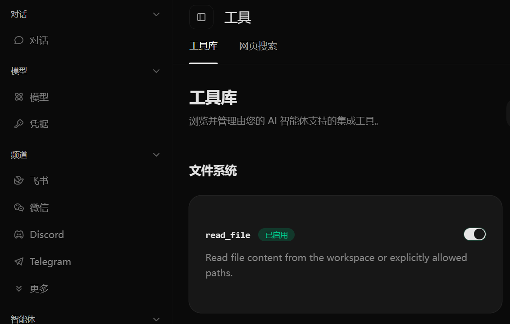
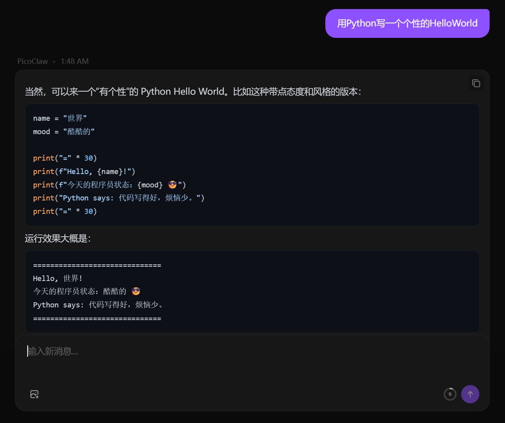
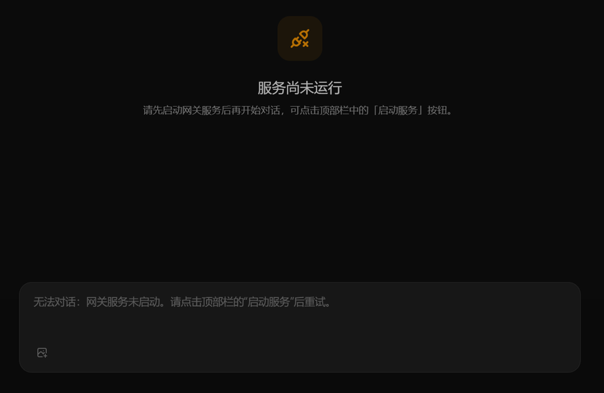
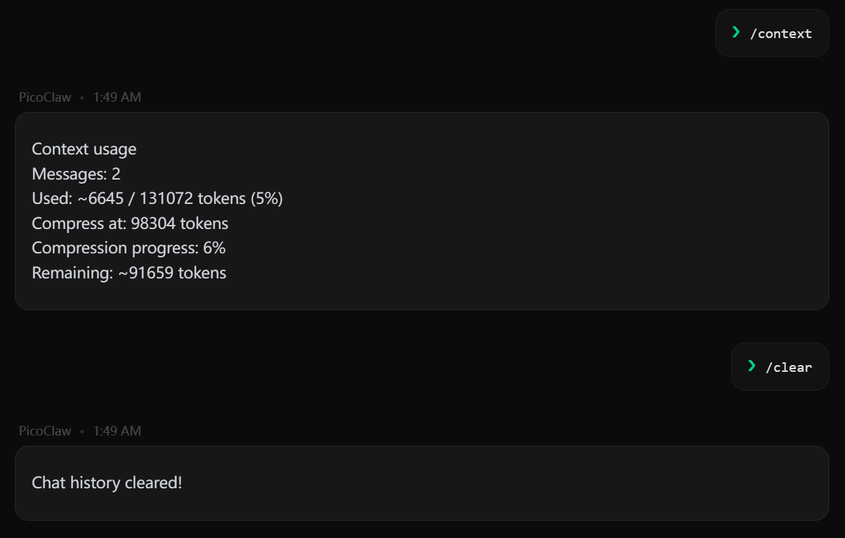
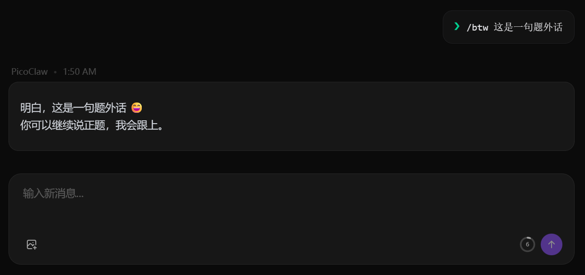

**2026 年 4 月 22 日** PicoClaw 团队发布 v0.2.7 版本

这个版本登录方式全面升级，AI 内部执行流程重写，Gemini 有了专属支持
还加了飞书群聊、Android 安装包等新功能

---

## 一、界面更新

### 工具页改版

原来的工具页拆成了两个标签：**"工具库"** 和 **"Web 搜索设置"**，找东西更方便

### 代码高亮

聊天里和技能里的代码块现在有**语法高亮**了，看代码舒服多了

### 其他改进

- 输入框禁用时会告诉你**为什么不能用**，不再干巴巴灰掉
- 聊天记录恢复更稳定，附件显示也修了
- 渠道配置支持**列表编辑**，一个渠道配多个实例更方便了

---

## 二、上下文更好用了

上一版加了 Seahorse 记忆引擎，这次继续打磨

- **`/context` 指令**——随时看当前对话用了多少 token，界面上也有个**用量小圆环**，一眼就知道还剩多少额度
- **`/clear` 升级**——现在不光清聊天记录，连 Seahorse 的短时记忆也一起清掉

- **`/btw` 旁白**——在对话中间插一句题外话，不会影响 AI 对主话题的理解

---

## 三、登录方式大改

这次把登录相关的流程统一梳理了一遍，用起来更顺了

### Launcher 启动器登录

现在是标准的**登录 → 初始化 → 退出**流程，干净利落
还支持**不开浏览器也能 OAuth 登录**——跑在没桌面的服务器上也能用了

### Dashboard 面板登录

网页后台从以前的 Token 方式改成了**密码登录**，跟你平时用的网站一样

### Gateway 网关连接

网关验证从以前要同时带 PID 和 Token 简化成了只用 **Token**，配置更简单

---

## 四、AI 执行流程重写

这块用户感觉不到变化，但内部是个大工程

以前 AI 干活的核心逻辑全堆在一个四千多行的大文件里，这次拆成了十几个小文件，每个只管一件事
然后又把整个执行流程重新理了一遍，拆得更清楚

一句话：**AI 干活的方式没变，但代码更好维护了，以后加新功能更快**

---

## 五、Gemini 专属支持

之前用 Gemini 是套了个兼容层，这次给它做了**原生对接**

- **思考和回复分开显示**——Gemini 在"想"什么、最终"说"什么，现在能区分开了
- Pro 模型的特殊要求也能正确处理了
- 工具调用时不会再串 ID 了
- 配套文档也补上了

---

## 六、平台和渠道

**飞书群聊**——支持群聊触发了，还能配置随机表情回复

**Android 安装包**——从这个版本开始，Release 页面直接提供 Android arm64 的安装包，不用自己编译了

**启动器也同步更新 (picoclaw_fui v0.1.3)**——Flutter 客户端也跟着大版本一起更新了：

- 登录认证集成——内嵌 core 升级到 v0.26 nightly，支持 auth 登录流程
- 关于页面——新增版本信息展示（App 版本 + Core 版本），多语言适配
- 配置页改进——保存前弹出确认、语言选择器、保存后自动重启服务
- 存储权限修复——解决部分设备上 Android Q+ SELinux errno 13 崩溃问题
- 浅色主题修复——设置页文字在浅色（樱花）主题下不再隐身
- 日志导出——导出按钮从纯图标改为文字按钮，不用猜了
- macOS WebView——支持 macOS 原生 WebView，系统托盘关窗不再退出
- CI/CD——新增 nightly/testly 自动构建，APK 自动上传火山引擎 TOS

**MCP 工具热重载**——之前重新加载配置后 MCP 工具会丢失，现在修好了

**图片发送修复**——给不支持图片的模型发图不会再卡死了，会自动恢复继续对话

---

## 七、稳定性修复

**工具调用不串了**——多轮对话里工具调用的 ID 现在能保持一致，不会莫名其妙断掉

**定时任务不串了**——每个定时任务现在用独立的会话，A 任务不会影响 B 任务

**网络出错能兜底**——超时、连接失败这些网络问题现在会自动尝试备选方案

---

## 八、工程改进

- CI 构建工具换成了 pnpm/action-setup，安装步骤也同步更新了
- 发版流程拆成了打 tag 和发布两步，更灵活
- 代码目录结构做了整理
- 文档按类型和语言重新分了目录，补上了 session 和路由相关文档
- 前后端依赖更新 15+ 项（React 19.2.5、shadcn 4.2.0、SQLite 1.48.2 等）

---

## 总结一下

| 类别 | 更新 |
|------|------|
| 🎨 界面 | 工具页改版、代码高亮、禁用原因提示 |
| 🧠 上下文 | `/context` 看用量、`/clear` 清记忆、`/btw` 插旁白 |
| 🔐 登录改版 | Launcher 统一登录流程、Dashboard 密码登录、Gateway 纯 Token |
| ⚙️ 内部重写 | AI 执行流程拆分重组，更好维护 |
| 🤖 Gemini | 原生支持，思考和回复分开显示 |
| 📱 平台 | Android 安装包/启动器、飞书群聊、MCP 热重载修复 |
| 🔧 稳定性 | 工具调用不串、定时任务隔离、图片发送修复 |

这个版本最大的变化是**登录流程全面统一，AI 执行引擎重新拆分组合，Gemini 原生支持**
登录更顺畅了，AI 干活更稳了，界面也更好用了——总之就是各种"该修的修了，该理的理了"

---

*PicoClaw — 轻量、跨平台、极速*

官网：picoclaw.io

GitHub：github.com/sipeed/picoclaw

文档：docs.picoclaw.io

Discord 社区：discord.gg/V4sAZ9XWpN
